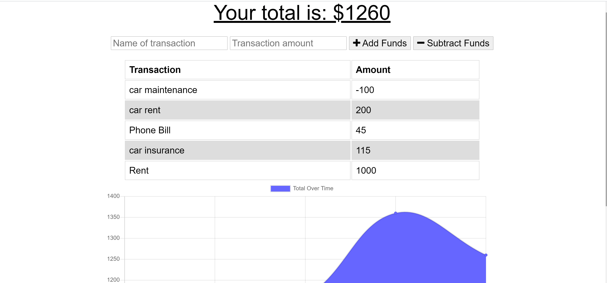

# budget-trackers

## Description
Budget Tracker application is a (PWA) progressive web application allow users to track their budgets by adding and subtracting  expenses.Users can also able to add and subtract a transaction with  without  connection. When users enter  transaction while offline, these transactions are stored in the indexedDB and transferred to the database when the user comes back online.

   ## Table of Contents
   * [Installation Instructions](#installation-instructions)
   
   * [Usage Instructions](#usage-instructions)
   
   * [Contribution](#contribution)
   
   * [Developer Contact Information](#Developer-Contact-Information)
     
  * [License](#license)

  ## Installation Instructions
The developer is authorizing a free installation by cloning from the code [negasimichael](https://github.com/negasimichael/workout-tracke).
   
   ## Usage Instructions

 * to start run
* npm install
* The app runs as a nodemon server.js or node server.js

   ## Screenshot Images
   

## Contribution
  [negasimichael](https://github.com/negasimichael/budget-trackers) is the only contrubuter of this project .

   ## Developer Contact Information
  * Linkedin Profile: [negasimichael](https://www.linkedin.com/feed/)
  * Deployed URL: [negasimichael](#)
  * Github URL: [negasimichael](https://github.com/negasimichael/budget-trackers)
  * Email: negasimichael1@gmail.com
  
## License
   .
 
 ------------------------------------------------------------------------------
© 2021 Trilogy Education Services, a 2U, Inc. brand. All Rights Reserved.
